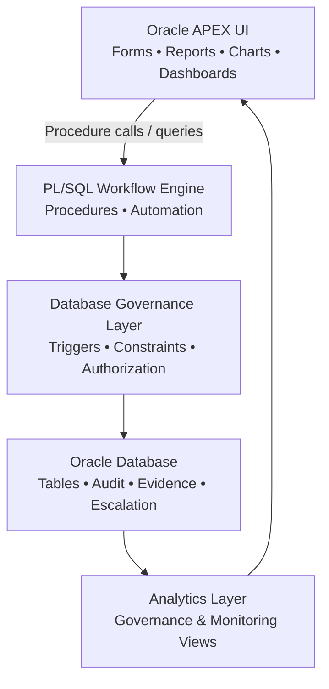
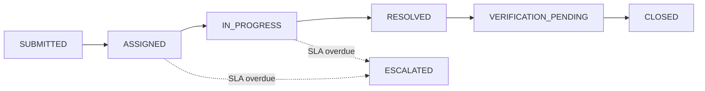
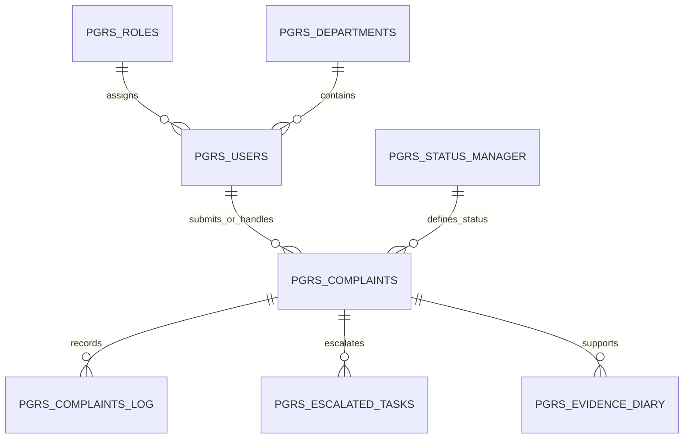
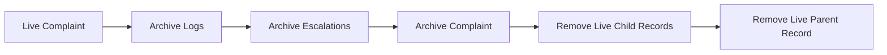
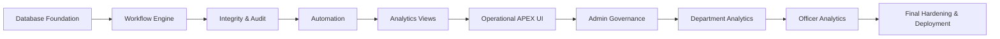

# PGRS — Public Grievance Redressal System

> **A database-first, governance-oriented municipal complaint lifecycle management platform built with Oracle APEX, Oracle Database and PL/SQL.**

[](#)
[](#)
[](#)
[](#)
[](#)
[](LICENSE)

---

## 📌 Project Status

**PGRS is an actively evolving project.**

The database foundation, governance workflow engine, automation layer, audit controls, analytics views and core operational APEX pages have been developed and validated. The administrative analytics layer is currently being expanded with additional drill-down pages, reporting capabilities and final presentation refinements.

> **This repository represents an ongoing engineering project rather than a claim of a fully deployed production system.**

---

## 🏛️ What is PGRS?

**PGRS (Public Grievance Redressal System)** is designed for municipal grievance management within a single-city governance model.

It manages the complaint lifecycle from:

```text
Citizen Submission
       ↓
Department Assignment
       ↓
Officer Assignment
       ↓
Investigation / Processing
       ↓
Resolution
       ↓
Citizen Verification
       ↓
Closure
```

When service-level conditions are violated, the system can automatically escalate eligible complaints.

The primary engineering objective is to ensure that **governance rules remain enforced by the database**, rather than depending solely on the APEX user interface.

---

# 🎯 Design Goals

PGRS is designed around six major goals:

- **Governance** — enforce controlled complaint lifecycle rules.
- **Integrity** — prevent invalid or unauthorized database changes.
- **Auditability** — preserve complaint history and workflow actions.
- **Automation** — handle SLA escalation, verification closure and archival.
- **Observability** — expose operational intelligence through database views.
- **Scalability** — use indexed access paths and controlled database operations.

---

# 🧱 Architecture

PGRS follows a **Database-First / Database-Centric Architecture**.



### Core Principle

> **UI displays and requests. PL/SQL controls workflow. The database enforces governance.**

The APEX layer is intentionally kept thin around core business operations.

---

# 🧠 Engineering Model

PGRS follows a deliberately controlled engineering model:

| Component | Responsibility |
|---|---|
| **APEX UI** | Presentation, user interaction and data visualization |
| **PL/SQL Procedures** | Business operations and workflow transitions |
| **Triggers** | Integrity guards and protection against invalid direct changes |
| **Constraints** | Relational and structural integrity |
| **Views** | Analytics, monitoring and reporting |
| **Indexes** | Performance and access-path optimization |
| **Automation Procedures** | Deterministic background governance operations |
| **Audit Tables** | Historical workflow traceability |

A simple way to remember the architecture:

```text
Procedure = Brain
Trigger   = Guard
View      = Intelligence
Index     = Accelerator
APEX      = Interface
```

---

# 🔄 Complaint Lifecycle

The controlled lifecycle is:



### Status Model

| STATUS_ID | STATUS_CODE |
|---:|---|
| 1 | SUBMITTED |
| 21 | ASSIGNED |
| 22 | IN_PROGRESS |
| 23 | RESOLVED |
| 41 | VERIFICATION_PENDING |
| 3 | ESCALATED |
| 2 | CLOSED |

### Governance Rules

- Escalation is permitted from `ASSIGNED` and `IN_PROGRESS`.
- Evidence is enforced before resolution where required.
- Verification is introduced after resolution.
- Verification can automatically close after the defined response period.
- Closed complaints are protected from modification.
- Reassignment is restricted to the Head Officer workflow.
- Officer assignment is department-aware.

---

# 👥 Role Model

| ROLE_ID | ROLE |
|---:|---|
| 1 | CITIZEN |
| 2 | OFFICER |
| 3 | ADMIN |
| 4 | SYSTEM |
| 21 | HEAD_OFFICER |

### Governance Responsibilities

**Citizen**
- Submit grievances
- Track complaints
- Participate in verification

**Officer**
- Process assigned complaints
- Update controlled workflow status
- Resolve complaints according to system rules

**Head Officer**
- Perform controlled officer reassignment
- Operate within department boundaries

**Admin**
- Monitor system health
- Analyze SLA performance
- Review department performance
- Monitor officer workload and delays
- Investigate escalations and SLA breaches

**System**
- Reserved for controlled system automation.

---

# 🏢 Department Model

Department master data is maintained in:

```text
PGRS_DEPARTMENTS
```

Current departments:

```text
ROADS
ELECTRICAL
SANITATION
DRAINAGE
```

Officer-to-department mapping is maintained through:

```text
PGRS_USERS.DEPT_ID
```

This allows department-aware governance to be enforced inside the database.

---

# 🗃️ Database Model

## Master Tables

```text
PGRS_ROLES
PGRS_DEPARTMENTS
PGRS_STATUS_MANAGER
PGRS_USERS
```

## Core Transaction Tables

```text
PGRS_COMPLAINTS
PGRS_COMPLAINTS_LOG
PGRS_ESCALATED_TASKS
PGRS_EVIDENCE_DIARY
```

## Archive Tables

```text
PGRS_COMPLAINTS_ARCH
PGRS_COMPLAINTS_LOG_ARCH
PGRS_ESCALATED_TASKS_ARCH
```

### Simplified Data Relationship



> The diagram is intentionally simplified. The database remains the authoritative source for the exact schema and relationships.

---

# ⚙️ Core PL/SQL Workflow Engine

## `PGRS_CREATE_COMPLAINT`

Creates a grievance while handling:

- Citizen identity
- Department association
- Automatic due-date generation
- Complaint insertion
- Initial audit logging

Uses safe identity retrieval with `RETURNING INTO`.

### Default Due Date

```text
TRUNC(SYSDATE) + 14
```

---

## `PGRS_UPDATE_COMPLAINT_STATUS`

The primary workflow engine.

Responsibilities:

- Validate allowed transitions
- Enforce role authorization
- Enforce evidence requirements
- Create verification stage
- Record audit activity
- Protect closed complaints

---

## `PGRS_REASSIGN_OFFICER`

Controlled Head Officer reassignment.

Rules include:

- Only `HEAD_OFFICER` may execute the operation.
- Complaint must be `IN_PROGRESS`.
- Target officer must belong to the same department.
- A reassignment remark is mandatory.
- `REASSIGNMENT_TOKEN` is used as a controlled mechanism for trigger-safe procedure execution.

---

# 🤖 Automation

## `PGRS_AUTO_ESCALATE`

Escalates eligible overdue complaints.

```text
due_date < SYSDATE
AND
is_escalated = 'N'
```

Actions:

```text
Update complaint status
        ↓
Create escalation record
        ↓
Create audit log entry
```

The operation is designed to be **idempotent**.

---

## `PGRS_AUTO_CLOSE_VERIFICATION`

Handles complaints remaining in:

```text
VERIFICATION_PENDING
```

for the defined verification period.

Current rule:

```text
7 days without citizen response
        ↓
CLOSED
```

---

## `PGRS_ARCHIVE_OLD_COMPLAINTS`

Archives complaints older than the defined retention threshold.

Current threshold:

```text
5 years
```

Simplified pipeline:



---

# 🛡️ Integrity & Protection Layer

Active database triggers include:

| Trigger | Purpose |
|---|---|
| `TRG_PGRS_DUE_DATE_LOCK` | Protect controlled due-date behavior |
| `TRG_PGRS_NO_UPDATE_CLOSED` | Prevent modification of closed complaints |
| `TRG_PGRS_OFFICER_ENFORCE` | Enforce officer assignment integrity |
| `TRG_PGRS_OFFICER_REASSIGN_LOCK` | Protect reassignment rules |
| `TRG_PGRS_LOG_IMMUTABLE` | Protect audit history |

The intent is to ensure critical governance controls remain effective even if a direct database operation attempts to bypass the APEX UI.

---

# 📈 Performance Strategy

Important indexes include:

```text
IDX_COMPLAINTS_STATUS
IDX_PGRS_SLA_OPT
IDX_LOG_COMPLAINT
IDX_LOG_COMPLAINT_ACTION
IDX_PGRS_LOG_STATUS_DATE
```

Execution-plan validation has been performed for important query paths, including:

```text
INDEX RANGE SCAN
```

The performance strategy focuses on:

- Selective indexed access
- SLA query optimization
- Complaint-status filtering
- Audit-log retrieval
- Avoiding unnecessary full-table processing

---

# 📊 Governance & Analytics Layer

The APEX monitoring layer consumes dedicated database views.

## Integrity

```text
V_PGRS_DATA_INTEGRITY_CHECK
```

## System Overview

```text
V_PGRS_SYSTEM_OVERVIEW
```

## SLA Monitoring

```text
V_PGRS_SLA_METRICS
V_PGRS_SLA_ALERT
V_PGRS_SLA_BREACH
V_PGRS_NEAR_SLA_BREACH
```

## Department Analytics

```text
V_PGRS_DEPARTMENT_METRICS
V_PGRS_DEPT_PENDING_SUMMARY
V_PGRS_DEPT_SLA_BREACH
```

## Officer Intelligence

```text
V_PGRS_OFFICER_WORKLOAD
V_PGRS_OFFICER_SLA_METRICS
V_PGRS_OFFICER_STAGE_DELAY
V_PGRS_OFFICER_RISK_PROFILE
```

## Escalation Monitoring

```text
V_PGRS_ESCALATION_PATTERN
V_PGRS_ESCALATION_TREND
```

## Lifecycle Analytics

```text
V_PGRS_LIFECYCLE_STAGE_METRICS
V_PGRS_STAGE_AGING
```

## Operational Monitoring

```text
V_PGRS_ACTIVE_COMPLAINTS
V_PGRS_CLOSURE_PERFORMANCE
```

---

# 🧪 Test Data & Validation

The project includes:

```text
PGRS_GENERATE_TEST_DATA
```

It is used to generate deterministic data for validating:

- Department distribution
- Officer workload
- Complaint lifecycle
- Evidence scenarios
- SLA behavior
- Verification stages
- Analytics

Simulated lifecycle states include:

```text
SUBMITTED
ASSIGNED
IN_PROGRESS
RESOLVED
VERIFICATION_PENDING
```

Automatic verification closure is handled separately by:

```text
PGRS_AUTO_CLOSE_VERIFICATION
```

---

# 🖥️ Oracle APEX Application

Current operational pages:

| Page | Purpose |
|---:|---|
| 0 | Global Page |
| 1 | Home Page |
| 9999 | Login Page |
| 10 | Citizen Complaint Submission |
| 20 | Complaint Tracking |
| 30 | Officer Dashboard |
| 40 | Head Officer Reassignment |
| 50 | Admin Governance Dashboard |
| 51 | Department Performance |

---

# 📊 Admin Governance Dashboard

### Page 50

The Admin Governance Dashboard provides system-wide governance visibility.

Current monitoring modules:

```text
System Health KPI Cards
SLA Risk Monitor
Department Complaint Distribution
Officer Workload Intelligence
Escalation Trend Monitor
SLA Breach Investigation
Officer Stage Delay Intelligence
```

### System Health

Uses:

```text
V_PGRS_SYSTEM_OVERVIEW
```

Provides:

- Total complaints
- Active complaints
- Closed complaints
- Escalated cases
- Verification pending

### SLA Risk Monitor

Uses:

```text
V_PGRS_SLA_METRICS
V_PGRS_NEAR_SLA_BREACH
V_PGRS_SLA_BREACH
```

Provides a visual distribution of:

```text
Safe
Near Breach
Breached
```

### Department Complaint Distribution

Uses:

```text
V_PGRS_DEPARTMENT_METRICS
```

Provides a comparative view of complaint volume by department.

### Officer Workload Intelligence

Uses:

```text
V_PGRS_OFFICER_WORKLOAD
```

Provides operational workload information including assigned, active, resolved and overdue cases where exposed by the view.

### Escalation Trend Monitor

Uses:

```text
V_PGRS_ESCALATION_TREND
```

Provides escalation activity over time.

### SLA Breach Investigation

Uses:

```text
V_PGRS_SLA_BREACH
```

Provides an administrative investigation report for breach records.

### Officer Stage Delay Intelligence

Uses:

```text
V_PGRS_OFFICER_STAGE_DELAY
```

Provides visibility into lifecycle-stage delays.

---

# 🔎 Department Performance

### Page 51

The Department Performance module provides department-level drill-down analysis.

Current functionality includes:

```text
Department Selector
        ↓
Department KPI Cards
        ↓
Department Complaint Trend
```

The department selector is sourced from active departments in:

```text
PGRS_DEPARTMENTS
```

The KPI layer dynamically presents:

- Total complaints
- Active complaints
- Resolved complaints
- Escalated complaints

The complaint trend dynamically responds to the selected department.

### Planned Expansion

The page is being expanded with:

- Department SLA health
- Department officer breakdown
- Additional department-level analytics
- Further filtering and presentation refinement

---

# 🔐 Security Philosophy

PGRS does not treat the APEX UI as the sole security boundary.

Critical governance controls are reinforced through:

```text
Role authorization
Department validation
Workflow transition rules
Database triggers
Audit protection
Closed-record immutability
Controlled reassignment
Procedure-based operations
```

This architecture reduces dependence on client-side or page-level enforcement.

---

# 🧾 Auditability

Workflow activity is recorded in:

```text
PGRS_COMPLAINTS_LOG
```

The audit layer is designed to preserve complaint history and prevent unauthorized modification.

Historical audit records can be moved to:

```text
PGRS_COMPLAINTS_LOG_ARCH
```

during archival processing.

---

# 🧪 Engineering & Testing Approach

The project follows a layered validation model.

### Functional Testing

Valid operations are checked against expected workflow outcomes.

### Negative Testing

Invalid operations are intentionally attempted, including:

- Unauthorized status transitions
- Invalid officer assignments
- Invalid department assignments
- Closed complaint updates
- Missing evidence
- Unauthorized reassignment

### Integrity Testing

Triggers and constraints are tested against direct manipulation scenarios.

### Automation Testing

Automation is checked for:

- Deterministic escalation
- Idempotent execution
- Verification auto-closure
- Safe archival ordering

### Performance Testing

Important query paths are reviewed using execution plans and indexes.

---

# 📁 Recommended Repository Structure

```text
PGRS/
│
├── README.md
├── LICENSE
│
├── apex-source/
│   ├── application/
│   ├── pages/
│   ├── shared-components/
│   └── ...
│
├── database/
│   ├── tables/
│   ├── constraints/
│   ├── indexes/
│   ├── triggers/
│   ├── procedures/
│   ├── views/
│   └── test-data/
│
├── documentation/
│   ├── architecture/
│   ├── database-design/
│   ├── workflow/
│   ├── deployment/
│   └── testing/
│
└── screenshots/
    ├── admin-dashboard.png
    ├── officer-dashboard.png
    ├── complaint-tracking.png
    └── ...
```

> The repository structure can evolve with the project. The important principle is to keep APEX source, database objects and documentation logically separated.

---

# 🚀 Deployment Philosophy

The intended deployment order follows database dependencies:

```text
1. Schema / Database User
2. Master Tables
3. Core Tables
4. Archive Tables
5. Constraints
6. Supporting Objects
7. Indexes
8. Triggers
9. PL/SQL Procedures
10. Analytics Views
11. Test / Seed Data
12. Oracle APEX Application
13. Application Security Configuration
14. Validation & Smoke Testing
```

Deployment scripts should preserve dependency order and should be validated against the target Oracle environment.

---

# 🗺️ Development Roadmap



### Current Direction

The project is currently progressing through:

```text
Admin Governance
        ↓
Department Analytics
        ↓
Officer Analytics
        ↓
Advanced Investigation
        ↓
Final Hardening
        ↓
Deployment Packaging
```

---

# 📌 Current Status

| Area | State |
|---|---|
| Database architecture | Established |
| Core workflow engine | Established |
| Role hierarchy | Established |
| Audit controls | Established |
| Automation layer | Established |
| Integrity triggers | Established |
| Analytics views | Established |
| Operational APEX UI | Established |
| Admin monitoring dashboard | Established |
| Department analytics | In progress |
| Officer analytics expansion | Planned |
| Final deployment packaging | Planned |

> **Status: Active Development**

The project is intentionally being developed in controlled stages. Additional analytics, security hardening, deployment packaging and presentation refinements may be introduced as the system evolves.

---

# 🏛️ Why Database-First?

A conventional application may place much of its business logic in:

```text
Frontend
   ↓
Application Code
   ↓
Database
```

PGRS deliberately emphasizes:

```text
APEX UI
   ↓
PL/SQL Workflow
   ↓
Database Governance
   ↓
Authoritative Data
```

The advantage is that critical rules remain enforceable even when data operations originate outside the primary UI.

This is particularly important for systems involving:

- Public complaints
- SLA commitments
- Administrative accountability
- Audit history
- Role-based operations
- Workflow state integrity

---

# 📚 Project Documentation

Additional documentation can be maintained under:

```text
documentation/
```

Recommended documentation areas:

- Architecture
- Database design
- Workflow rules
- Deployment
- Testing
- Security
- Analytics definitions

---

# 📜 License

This project is licensed under the **MIT License**.

See [`LICENSE`](LICENSE) for details.

---

## 👨‍💻 Project

**PGRS — Public Grievance Redressal System**

A governance-oriented Oracle APEX project demonstrating:

- Database-first application architecture
- Oracle Database engineering
- PL/SQL workflow design
- SLA automation
- Escalation management
- Auditability
- Database integrity controls
- Role-aware governance
- Operational analytics
- Administrative monitoring
- Enterprise-oriented system design

---

> **PGRS is a continuously evolving engineering project. The architecture and implementation are being refined incrementally as additional governance, analytics and deployment capabilities are introduced.**
